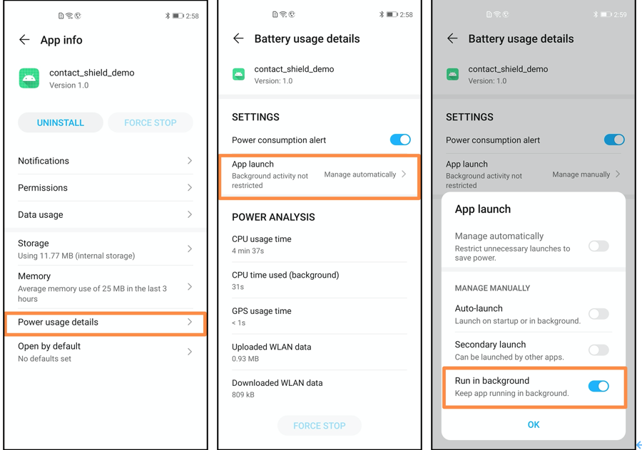

# Contact Shield Demo

#### General Idea:

- All devices keep exchanging annoymous identifiers using Bluetooth
- If someone is tested positive, he needs to upload his annoymous identifiers to the server everyday for everyone to download
- All users can download patient identifiers from server and compare identifiers they collect to get their latest exposure information

#### Device suggestion:

- EMUI 10
- HMS Core 5.0.1.307 or above

#### Begin the test:

- Download contact_shield_demo.apk from huawei browser and install
- Make sure Storage and Location permissions have been granted all the time
  - Location permission is used for Bluetooth only and we will not use GPS data
- Allow App to run in background, which is adjusted in “Power Usage Details” in settings. 

#### Upload Periodic Keys:

- If you choose to be the patient, you can upload your periodic keys by either QR code or TeleTAN
- These information can be found at http://3.16.177.15:5000/portal

#### Check current exposure:

- Click refresh to get the latest exposure information

